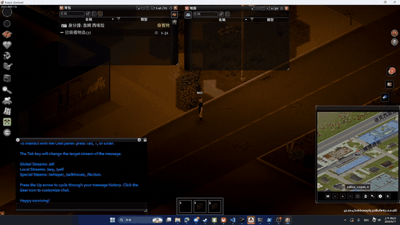

# Minidoracat IME Guard for B42

Project Zomboid Build 42 的輸入法守衛：玩遊戲時自動把 PZ 切到英文鍵盤，打字時切回你原本的輸入法。注音、拼音、日文、韓文……任何 Windows 輸入法都適用。單人、多人皆可；多人時伺服器要把本 MOD 列進 `Mods=`（PZ 只載入伺服器清單上的 MOD），伺服器端本身不執行任何東西。

完整操作影片（下載 → 執行 → 遊戲內打中文，35 秒）：https://youtu.be/5q1bfbm3lgU

## 為什麼需要

Windows 上只要中文／日文／韓文輸入法處於組字模式，按下的每一個鍵都會先交給輸入法，PZ 使用的視窗程式庫（GLFW）會直接忽略這種按鍵——所以 WASD、Shift 跑步、空白鍵、E 互動全部沒反應，角色站在原地被殭屍咬。更糟的是 PZ 的操作鍵剛好是 Windows 切輸入法的熱鍵（Shift 跑步＋Alt 衝刺＝Alt+Shift；Ctrl 瞄準＋空白＝Ctrl+Space），玩到一半就會被切回中文。官方已明講不會在遊戲端處理。

## 怎麼用（玩家）

這是**兩件式**：MOD 負責告訴工具「玩家現在是不是在打字」，工具負責切輸入法。只訂閱 MOD 不會有任何效果。

1. 訂閱 [Workshop 上的 MOD](https://steamcommunity.com/sharedfiles/filedetails/?id=3802890539) 並啟用。
2. 到 [Releases](https://github.com/Minidoracat/MinidoracatIMEGuardFor42/releases/latest) 下載 `pz-ime-guard.exe`，放在任何地方執行。第一次會跳 SmartScreen「Windows 已保護您的電腦」（未簽章 exe 的正常提示）：點「其他資訊 → 仍要執行」，或先對 exe 右鍵 → 內容 → 勾「解除封鎖」。它沒有視窗，只在系統匣放一個鍵帽圖示（Windows 11 通常收在「^」隱藏區，第一次啟動會彈一次說明），右下角的小燈代表狀態：
   - 灰：還沒找到 PZ 視窗、PZ 不在前景、已暫停，或遊戲正在關閉（已停止守護）
   - 綠：PZ 已在英文鍵盤，移動鍵安全
   - 橘：你正在打字，已切回你的輸入法
   - 紅：系統沒有安裝「英文（美國）」鍵盤，工具無事可做
   右鍵圖示有：關於（版本）、Workshop 頁面、GitHub、切出遊戲時還原桌面的輸入法（預設開）、登入 Windows 時自動啟動（預設關）、自動檢查更新（預設開，啟動時與每日查一次 GitHub Releases，有新版問你要不要開下載頁）、暫停、結束。工具只會開一份，重複執行會提示後自動關閉。提示文字、選單與首次說明依 Windows 顯示語言自動切換（繁中／簡中／英文／日文／韓文）。
   還原輸入法：離開或關掉遊戲時，嘗試還原進遊戲前觀察到的桌面輸入法。工具必須曾確認自己將 PZ 切到安全鍵盤，且知道桌面原本使用的非安全配置，才會還原；不知道原配置時不猜測。還原有重試次數與時間上限，無法保證所有程式都接受切換。
   自動啟動：勾選後只在目前使用者的「啟動」資料夾放捷徑 `pz-ime-guard.lnk`，不寫登錄檔、不建服務。預設沒有這個捷徑。在「設定 → 應用程式 → 啟動」停用，不等於捷徑被刪，選單仍可能顯示已勾。把 exe 搬到別的地方後，捷徑還指著舊路徑；手動開一次新位置的工具（選項保持勾選）才會改寫。這是登入後啟動，不是一開機就跑，Windows 也可能晚一點才叫起來。
3. 開遊戲。進遊戲時若工具沒在跑，畫面上會提醒一次。

若你有開 Windows「設定 → 時間與語言 → 輸入 → 進階鍵盤設定 → 讓我為每個應用程式視窗設定不同的輸入法」，其他程式通常會保留各自的配置。未開啟時，離開遊戲會嘗試還原桌面輸入法（見上方）；不知道原配置或還原未成功時，桌面仍可能停在英文。

限制：只支援 Windows；一台電腦同時開兩個 PZ 時只守第一個視窗；PZ 用 `-cachedir` 改了資料夾的話工具找不到訊號檔。

## 運作方式

- MOD（純 Lua，零 native）：每 frame 讀一次遊戲自己的「玩家正在打字」旗標，變化時把 `1`／`0` 寫進 `%USERPROFILE%\Zomboid\Lua\MinidoracatIMEGuard\state.txt`。玩家確認關掉遊戲（不是回主選單）時另寫 `exiting.txt` 的 `1`，讓工具在視窗還開著、遊戲還在收尾時就停止守護並開始還原。按視窗 X、當掉、工作管理員強制結束不會寫這個訊號，只能等視窗消失。工具只認自己啟動之後寫下的訊號，上一局留下的不會讓下一局停守。這個行為要新的 MOD 和新的 exe 一起才有；只更新一邊等於沒有。
- 工具（Rust，單一靜態 exe，約 360 KB）：監看 `state.txt` 所在目錄，MOD 一寫檔就醒來（實測寫檔到 PZ 換好配置 16–39 ms；另每 100 ms 輪詢一次接前景切換與 Alt+Shift 劫持），依旗標決定該用哪個鍵盤配置，不對就對 PZ 視窗送 `WM_INPUTLANGCHANGEREQUEST`，下一輪回讀確認。還原桌面時，只對你切過去、且已穩定的那個前景視窗送有限次數的同樣請求並回讀確認；沒有還原目標就不動。不裝鍵盤 hook、不代送按鍵、不改登錄檔。每 2 秒寫 `heartbeat.txt` 讓 MOD 知道它活著。

退場條件：[LWJGL #946](https://github.com/LWJGL/lwjgl3/issues/946) 的 GLFW IME 修正合併、且 PZ 升到帶該修正的 LWJGL 版本時，這個 MOD 就不再需要。

**支援哪些輸入法**：工具只看 Windows 鍵盤配置的語言，不認輸入法品牌。凡是 Windows 歸類為「輸入法（IME）」而非「鍵盤配置」的語系都視為會攔按鍵：中文（注音、無蝦米、倉頡、微軟／搜狗拼音、RIME…）、日文（Microsoft IME、Google 日本語入力…）、韓文——中、日有 PZ 玩家實證，韓文依微軟文件與 imgui 記錄確認同樣發 `VK_PROCESSKEY`；越南文 Telex／VNI、印度語系 Phonetic、切羅基、阿姆哈拉、提格利尼亞依微軟文件同為 IME，機制相同但沒有實機驗證。其他配置（英文各國變體、俄、德、法、泰…）視為安全、完全不介入。打字時切回的是「你在 PZ 視窗上最後用過的那個輸入法」，不是系統預設——裝了兩種想換另一種，在聊天框 Win+Space 切一次就記住。系統裡完全沒有非 IME 配置（只裝了注音、沒裝英文）時工具無事可做：啟動時會彈警告，按「是」直接開 Windows 語言設定頁；圖示變紅，你在設定裡新增「英文（美國）」後不用重啟，工具會自己偵測到並開始運作。

**介面語言**：工具提示、選單、首次說明與 MOD 內提示有繁中／簡中／日文／韓文，其餘顯示英文（韓文由非母語者撰寫，歡迎校對）。

## 開發

- Lua：`MOD/MinidoracatIMEGuardFor42/Contents/mods/MinidoracatIMEGuardFor42/42/media/lua/client/IMEGuard/`
- 工具：`tools/pz-ime-guard/`，`cargo build --release` 產出 `target/release/pz-ime-guard.exe`（`.cargo/config.toml` 已設靜態 CRT）
- 閘門（提交前都要綠）：`uv run scripts/verify_mod.py`、`lua scripts/smoke_harness.lua`
- `link_workshop.bat`／`PZ_Test.bat`／`Publish_Workshop.bat` 用法同家族其他 MOD

## 版本

版本號格式：`{PZ 版本}-{mod 版本}`（例 `42.20.4-0.1.0`），詳見 [CHANGELOG.md](CHANGELOG.md)。工具版本獨立（`tools/pz-ime-guard/Cargo.toml`）。

## 移除

工具沒有安裝程式。若曾勾「登入 Windows 時自動啟動」，先取消勾選再結束；已經刪掉 exe、選單開不了的話，到「啟動」資料夾刪掉 `pz-ime-guard.lnk`（檔案總管網址列輸入 `shell:startup`）。然後刪掉 `pz-ime-guard.exe`。它不寫登錄檔。`%USERPROFILE%\Zomboid\Lua\MinidoracatIMEGuard\` 裡可能留下 `state.txt`、`heartbeat.txt`、`settings.txt`、`first-run-done.txt`、`exiting.txt`，可一併刪除。MOD 在 Workshop 取消訂閱即可。

## Code signing policy

Free code signing provided by [SignPath.io](https://about.signpath.io), certificate by [SignPath Foundation](https://signpath.org).

- **Committers and reviewers**: [Minidoracat](https://github.com/Minidoracat)（repo owner；本專案目前為單人維護，所有變更由 owner 提交）
- **Approvers**: [Minidoracat](https://github.com/Minidoracat)（repo owner）
- **Privacy policy**: This program will not transfer any information to other networked systems unless specifically requested by the user or the person installing or operating it. The only network access is the optional update check (GitHub Releases API, on by default, can be disabled from the tray menu), which sends no user data.
- 簽章的 exe 一律由 GitHub Actions 從本 repo 的 tag 建置（`.github/workflows/release.yml`），每個 Release 都須人工核准簽章；SHA-256 與 VirusTotal 報告附在 Release 頁。

## 作者

Minidoracat — [Discord](https://discord.gg/Gur2V67) | [Twitch](https://www.twitch.tv/minidoracat)

## 授權

MIT，見 [LICENSE](LICENSE)。MOD 與 `pz-ime-guard` 工具皆適用。
